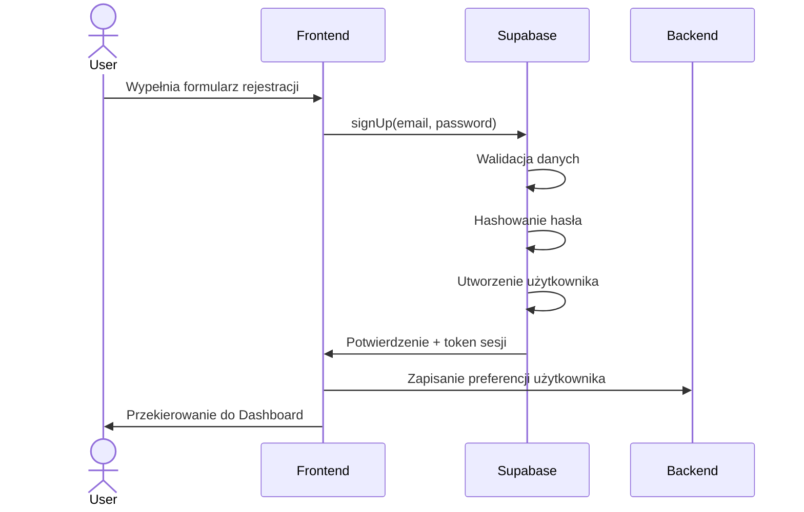
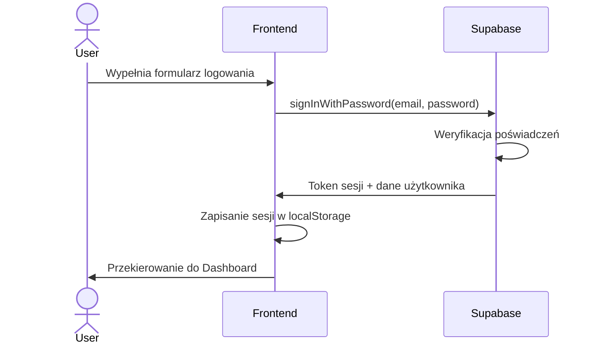
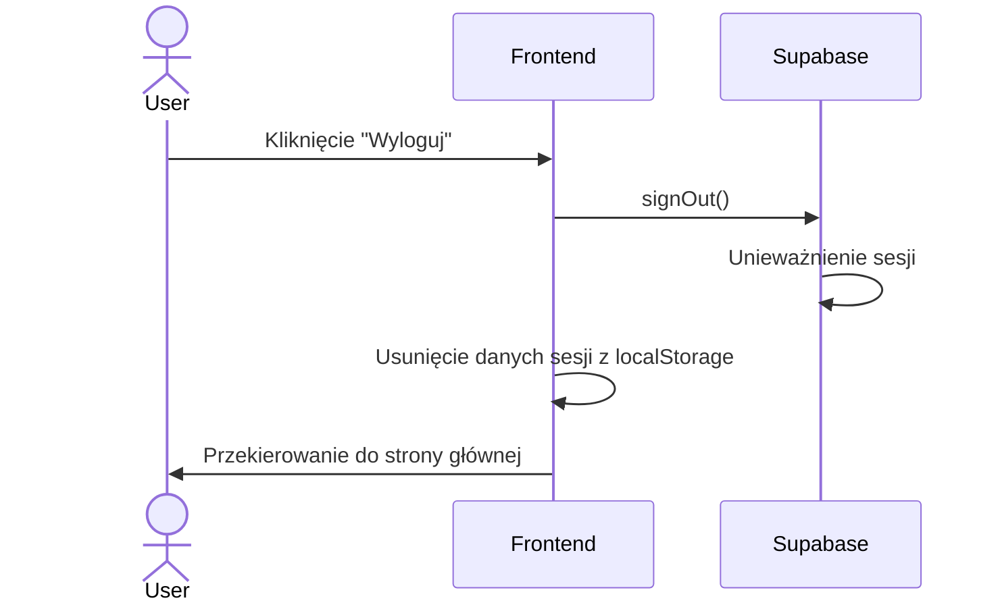
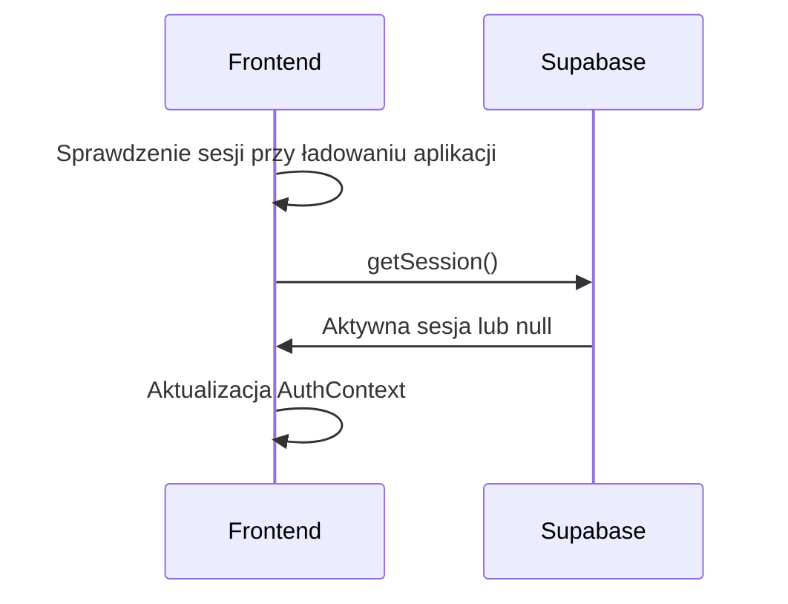
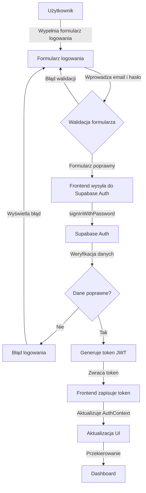
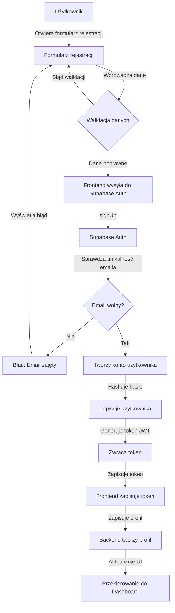
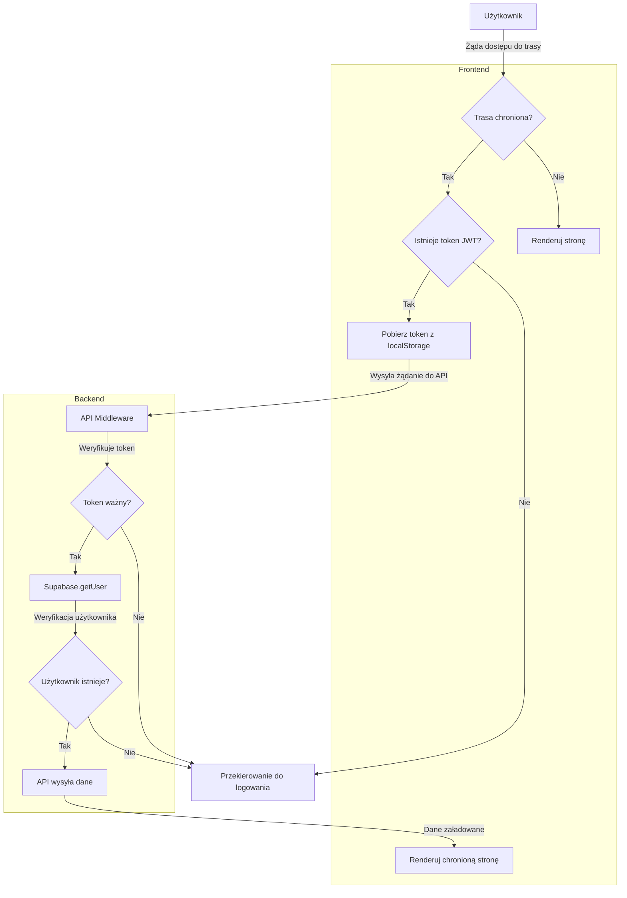

# Specyfikacja Architektury Autentykacji - HealthyMeal

## 1. Przegląd architektury

Architektura autentykacji HealthyMeal wykorzystuje Supabase Auth jako główny mechanizm uwierzytelniania. System ten zapewnia bezpieczne logowanie za pomocą email i hasła, ochronę stron przed nieautoryzowanym dostępem oraz zarządzanie sesją użytkownika.

```
┌──────────────┐     ┌──────────────┐     ┌──────────────────┐
│   Frontend   │◄───►│    Backend   │◄───►│  Supabase Auth   │
│    (React)   │     │   (Node.js)  │     │                  │
└──────────────┘     └──────────────┘     └──────────────────┘
```

## 2. Kluczowe komponenty

### 2.1 Frontend (React)
- **AuthProvider** - kontekst Reacta zapewniający informacje o stanie autentykacji
- **PrivateRoute** - komponent chroniący trasy dla zalogowanych użytkowników
- **AuthForms** - komponenty formularzy logowania/rejestracji
- **NavBar** - komponent odpowiedzialny za wyświetlanie stanu autentykacji
- **supabase-js** - biblioteka kliencka do komunikacji z Supabase

### 2.2 Backend (Node.js/Express)
- **AuthMiddleware** - middleware weryfikujące tokeny JWT z Supabase
- **UserController** - kontroler zarządzający operacjami na użytkownikach
- **AccessControl** - system kontroli dostępu do zasobów
- **supabase-js** - biblioteka serwerowa do komunikacji z Supabase

### 2.3 Supabase Auth
- **Autentykacja Email/Hasło** - główna metoda uwierzytelniania 
- **JWT Management** - generowanie i weryfikacja tokenów
- **Session Management** - zarządzanie sesją użytkownika
- **User Management** - przechowywanie profili użytkowników

## 3. Przepływ autentykacji

### 3.1 Rejestracja użytkownika


1. Użytkownik wypełnia formularz rejestracji podając email, hasło i imię
2. Frontend wywołuje `supabase.auth.signUp()` z danymi użytkownika
3. Supabase waliduje dane, hashuje hasło i tworzy użytkownika
4. Frontend otrzymuje token sesji i informacje o użytkowniku
5. Backend zapisuje dodatkowe preferencje użytkownika w bazie danych
6. Użytkownik jest automatycznie zalogowany i przekierowany do dashboardu

### 3.2 Logowanie użytkownika


1. Użytkownik wypełnia formularz logowania
2. Frontend wywołuje `supabase.auth.signInWithPassword()` z poświadczeniami
3. Supabase weryfikuje poświadczenia i zwraca token sesji oraz dane użytkownika
4. Frontend zapisuje dane sesji w localStorage
5. Użytkownik jest przekierowany do dashboardu

### 3.3 Wylogowanie


1. Użytkownik klika przycisk "Wyloguj"
2. Frontend wywołuje `supabase.auth.signOut()`
3. Supabase unieważnia sesję użytkownika
4. Frontend usuwa dane sesji z localStorage
5. Użytkownik jest przekierowany do strony głównej

### 3.4 Zarządzanie sesją


1. Przy każdym ładowaniu aplikacji, sprawdzany jest stan sesji
2. Supabase sprawdza ważność tokenu JWT i automatycznie odświeża go, jeśli to konieczne
3. AuthContext jest aktualizowany ze stanem autentykacji
4. Komponenty UI reagują na zmiany stanu autentykacji

## 4. Ochrona tras i zasobów

### 4.1 Frontend - Protected Routes
```jsx
// Przykładowa implementacja PrivateRoute
const PrivateRoute = ({ children }) => {
  const { session, loading } = useAuth();
  
  if (loading) return <LoadingSpinner />;
  
  return session ? children : <Navigate to="/" />;
};
```

Chronione trasy:
- `/dashboard`
- `/recipes/*`
- `/profile/*`
- `/feedback`

Publiczne trasy:
- `/` (strona główna)
- `/404`

### 4.2 Backend - Auth Middleware
```js
// Przykładowa implementacja middleware uwierzytelniania
const authMiddleware = async (req, res, next) => {
  const token = req.headers.authorization?.split(' ')[1];
  
  if (!token) {
    return res.status(401).json({ error: 'Brak autoryzacji' });
  }
  
  try {
    const { data, error } = await supabase.auth.getUser(token);
    
    if (error) throw error;
    
    req.user = data.user;
    next();
  } catch (error) {
    return res.status(401).json({ error: 'Nieprawidłowy token' });
  }
};
```

Chronione endpointy (wymagające middleware):
- `/api/users/*`
- `/api/recipes/*`
- `/api/ai/*`
- `/api/feedback/*`

Publiczne endpointy:
- `/api/auth/*` (tylko niektóre)

## 5. Struktura danych użytkownika

### 5.1 Tabela auth.users (zarządzana przez Supabase)
```
- id: UUID (primary key)
- email: string (unique)
- password: string (hashed)
- created_at: timestamp
- updated_at: timestamp
- last_sign_in_at: timestamp
```

### 5.2 Tabela profiles (niestandardowa)
```
- id: UUID (foreign key to auth.users.id)
- name: string
- diet_type: string
- max_carbs: number
- excluded_products: string[]
- allergens: string[]
- created_at: timestamp
- updated_at: timestamp
```

## 6. Implementacja interfejsu użytkownika

### 6.1 Nawigacja dla niezalogowanych użytkowników
- Przyciski "Zaloguj się" i "Zarejestruj się" w nagłówku strony głównej
- Modalne okna logowania/rejestracji
- Komunikaty o błędach walidacji

### 6.2 Nawigacja dla zalogowanych użytkowników
- Spójny NavBar na wszystkich chronionych stronach zawierający:
  - Logo/nazwę aplikacji
  - Menu nawigacyjne do głównych sekcji
  - Informację o zalogowanym użytkowniku (imię/email)
  - Przycisk wylogowania
  - Wskaźnik wykorzystania limitu AI

### 6.3 Notyfikacje związane z autentykacją
- Toast/powiadomienia o pomyślnym zalogowaniu/wylogowaniu
- Komunikat o wygaśnięciu sesji
- Komunikaty błędów autentykacji

## 7. Bezpieczeństwo

### 7.1 Ochrona danych
- Hasła hashowane przez Supabase Auth (Bcrypt + salt)
- JWT z krótkim okresem ważności (1 godzina)
- Refresh token z dłuższym okresem ważności (2 tygodnie)
- HTTPS dla wszystkich połączeń z Supabase

### 7.2 Zabezpieczenia przed atakami
- Rate limiting logowań (3 próby przed czasową blokadą)
- Zabezpieczenie przed CSRF
- Content Security Policy (CSP)
- Sanityzacja danych wejściowych

### 7.3 Row Level Security (RLS)
Supabase umożliwia konfigurację polityk bezpieczeństwa na poziomie wierszy w bazie danych:

```sql
-- Przykład polityki RLS: Użytkownik może odczytać tylko własne przepisy
CREATE POLICY "Users can read own recipes"
ON recipes
FOR SELECT
USING (auth.uid() = user_id);
```

## 8. Wdrożenie i konfiguracja

### 8.1 Konfiguracja Supabase
1. Utworzenie projektu w Supabase
2. Konfiguracja dostawców autentykacji (email + hasło)
3. Konfiguracja polityk bezpieczeństwa RLS
4. Ustawienie zmiennych środowiskowych dla kluczy API

### 8.2 Integracja z aplikacją
1. Instalacja biblioteki klienta Supabase:
   ```
   npm install @supabase/supabase-js
   ```
2. Konfiguracja klienta:
   ```js
   const supabase = createClient(
     process.env.REACT_APP_SUPABASE_URL,
     process.env.REACT_APP_SUPABASE_ANON_KEY
   );
   ```
3. Implementacja komponentów autentykacji
4. Integracja z istniejącymi stronami i przepływami

## 9. Monitorowanie i analityka

- Logowanie nieudanych prób logowania
- Monitorowanie aktywnych sesji
- Zbieranie statystyk użycia (rejestracje, logowania, nieudane próby)
- Alerty bezpieczeństwa dla nietypowych wzorców

## 10. Diagramy przepływów

### 10.1 Przepływ logowania użytkownika


### 10.2 Przepływ rejestracji użytkownika


### 10.3 Ochrona tras przy użyciu tokenu Supabase


## 11. Przyszłe rozszerzenia

- Uwierzytelnianie dwuskładnikowe (2FA)
- Logowanie przez OAuth (Google, Facebook, Apple)
- Uwierzytelnianie przez Magic Link (bez hasła)
- Zarządzanie rolami użytkowników
- System zaproszeń i współdzielenia przepisów 

## 12. Testowanie komponentów autentykacji

### 12.1 Atrybuty testowe
Komponenty związane z autentykacją powinny zawierać następujące atrybuty testowe (data-testid):

- `login-form` - formularz logowania
- `login-page` - strona logowania
- `email-input` - pole wprowadzania adresu email
- `password-input` - pole wprowadzania hasła
- `login-button` - przycisk logowania
- `register-page` - strona rejestracji
- `password-reset-page` - strona resetowania hasła
- `success-message` - komunikat o powodzeniu operacji
- `error-message` - komunikat o błędzie

### 12.2 Środowisko testowe
Do testowania komponentów autentykacji zaleca się:

1. Utworzenie oddzielnego projektu w Supabase przeznaczonego do testów
2. Konfigurację zmiennych środowiskowych w pliku `.env.test` lub `cypress.env.json`
3. Wykorzystanie konta testowego utworzonego specjalnie do celów testowych
4. Izolację testów, aby zapobiec wzajemnemu wpływaniu na siebie 